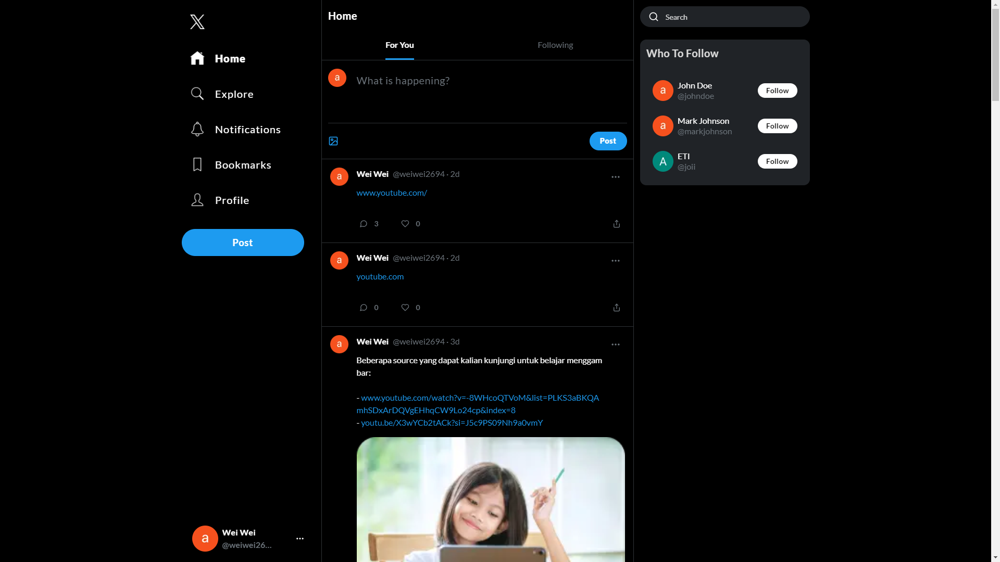
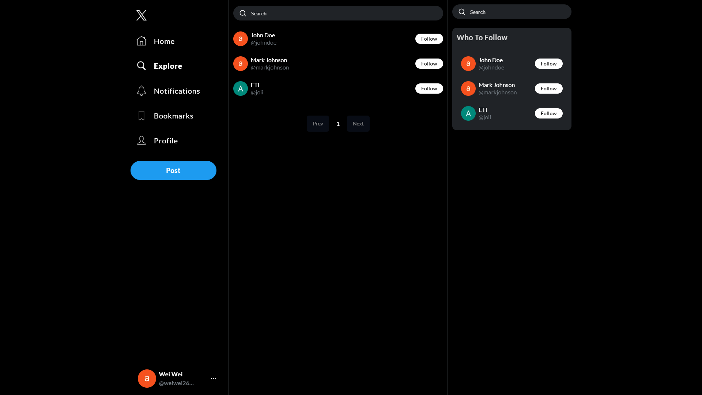
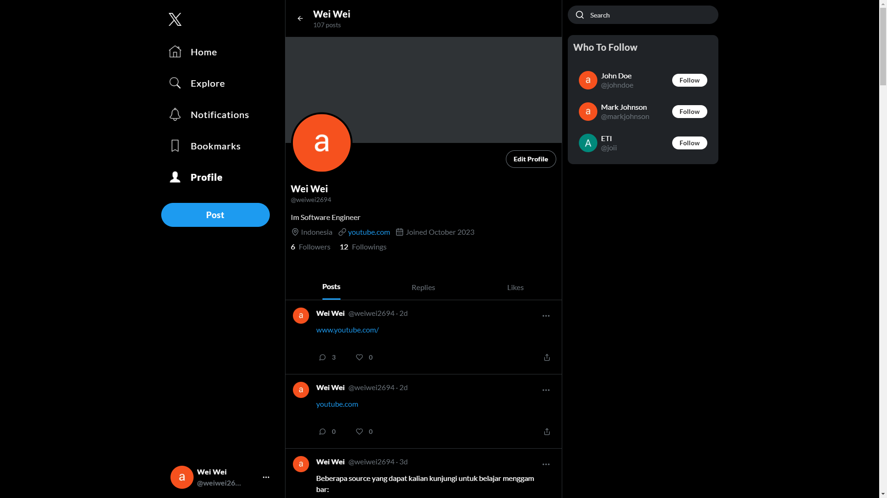

# Fullstack X Twitter Clone: Next.js 13, React, Typescript, Prisma, Clerk, Tailwind CSS, Cloudinary, MySQL, Shadcn UI, Zustand

This project does not implement Websockets, so it still has defects in toggle like, bookmark and follow. and it took me about 3-4 weeks to do it, and of course I learned a lot of new things.

<table style="width:100%; border: 0px; box-sizing: border-box;">
  <tr>
    <td>
      <figure>
				
			</figure>
    </td>
    <td>
      <figure>
				
			</figure>
    </td>
    <td>
      <figure>
				
			</figure>
    </td>
    <td>
      <figure>
				
			</figure>
    </td>
  </tr>
	<tr>
		<td>
			<figure>
				
			</figure>
		</td>
	</tr>
</table>

## Key Features
- Create Tweet - image upload, link
- Delete Tweet
- Share Tweet
- Reply Tweet
- Like Tweet
- Bookmark Tweet
- Follow User
- Notifications - like, comment, reply, follow
- Search Menu - search for user
- Search and Explore Page
- Edit Profile
- Profile - posts, replies, likes
- Pagination
- Beautiful UI using TailwindCSS and ShadcnUI
- Full responsivity and mobile UI
- MySQL database using Railways
- ORM using Prisma
- Authentication with Clerk

## Cloning the repository
```bash
git clone https://github.com/weiwei2694/x-twitter-clone.git
cd x-twitter-clone
```

## Install packages
```bash
npm install
yarn install
pnpm install
bun install
```

## Setup .env file
```bash
# CLERK
NEXT_PUBLIC_CLERK_PUBLISHABLE_KEY=
CLERK_SECRET_KEY=
NEXT_PUBLIC_CLERK_SIGN_IN_URL=/sign-in
NEXT_PUBLIC_CLERK_SIGN_UP_URL=/sign-up
NEXT_PUBLIC_CLERK_AFTER_SIGN_IN_URL=/onboarding
NEXT_PUBLIC_CLERK_AFTER_SIGN_UP_URL=/onboarding

# DATABASE
DATABASE_URL=

# CLOUDINARY
NEXT_PUBLIC_CLOUDINARY_NAME=
NEXT_PUBLIC_UPLOAD_PRESET=

# NEXT URL
NEXT_PUBLIC_NEXT_URL=http://localhost:3000
```

## Setup Prisma
Add MySQL Database (I used Railway)
```bash
npx prisma generate
npx prisma db push
```

## Available commands
| Command         | Description                                   |
| --------------- | --------------------------------------------- |
| `npm run dev`   | Starts a development instance of the app     |
| `npm run build` | Builds the app for production                |
| `npm run start` | Starts the app in production mode            |
| `npm run prettier`   | Check and format code using Prettier      |
| `npm run prettier:fix` | Format code using Prettier (fix issues)   |
